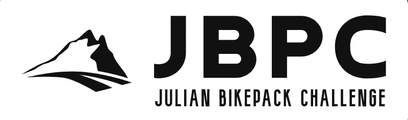
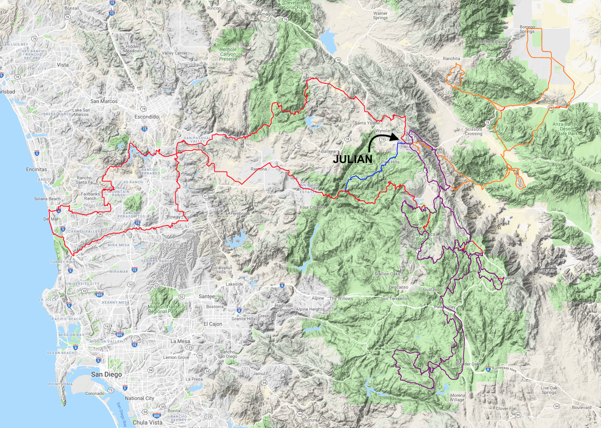

A bikepacking adventure through San Diego County, California. Starting from the mountain town of Julian the BFL, Beach, Mountain & Desert Loops showcase the area's diverse regions, climate and finest riding.

The Julian Bikepack Challenge was originally created as a 3 loop bikepacking route to highlight the incredibly diverse terrain and scenery around San Diego County. The Beach, Desert and Mountain loops are all a mix of pavement, two track and singletrack trails with varying technical levels. Total distance for all three loops is around 450 miles with over 45,000 feet of elevation gain. Total time to do the entire route will be 4-9 days. Each loop has unique character and challenges, and can be done individually.

A single loop option, known as the BFL, combines parts of each of the 3 loops into a big single loop. This loop is close to 300 miles and over 25,000 feet of elevation gain. Should be doable in 3-6 days.

## IMPORTANT INFORMATION!

Currently, there are 2 sections of the route which need to be avoided:

The CA Department of Fish and Wildlife (I believe?) shut down a short section of the trail between Pamo Rd and SR78 (around mile 32 on the BFL). This means the entire 4.5 mile section has to be bypassed by continuing south on Pamo Rd, to West Haverdford Rd onto SR78 heading west to rejoin the route. This highway can carry a lot of traffic at times, so be cautious.
  
There have been reports that the old Banner Toll Road heading up into Julian (around mile 120 on BFL) is overgrown and torn up, for now stick to the asphalt up Banner Grade then use Wynola & Farmer Rd into Julian.

